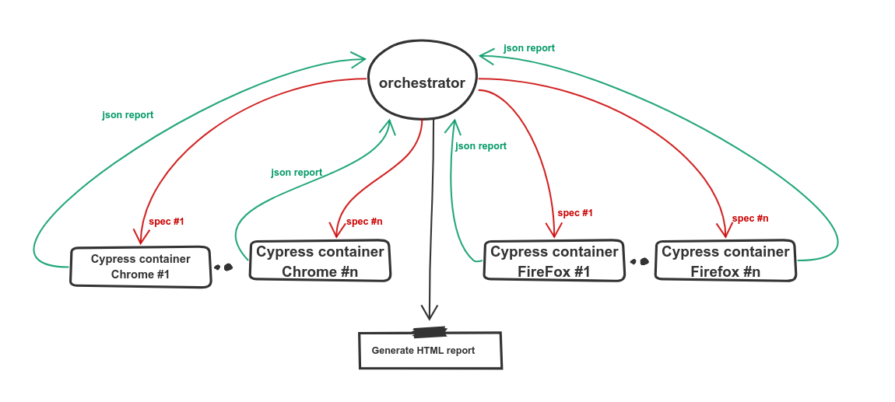

# 🔥 orchestrator 🔥


Orchestrator executes all cypress specs across n parallel docker containers based on a configuration file.

## 😎 Orchestrator Tutorial:
1- [Cypress parallelization with the Orchestrator — part 1](https://0xislamtaha.medium.com/cypress-parallelization-with-the-orchestrator-part-1-255989094deb)

2- [Cypress parallelization with the Orchestrator — part 2 — ShowCase](https://0xislamtaha.medium.com/cypress-parallelization-with-the-orchestrator-part-2-showcase-c78202b17c7a)

## 😍 Usecases:
Check the following repo as a public use case.
- [Orchestrator-Public-Use-Case](https://github.com/0xIslamTaha/orchestrator-public-use-case)

## ♟️ Orchestrator mechanism:

* Pares a config file.
* Create (config.parallelizm * config.browsers.length) containers in parallel.
* Recursively list all the specs files 
* Split all the specs across all those machines based on their execution time.
* Collect all the execution json reports from those containers.
* Down all the running containers.
* Generate one HTML report that has all specs execution results.
* Analyse the execution time for each spec.
* Generate the execution time reports per browser under ExecutionTimeReport dir.
* In the next run, The orchestrator It will split the test cases based on this execution time report to reduce the exeuction time.


## 🏹 The Splitting mechanism:
The orchestrator can measure and report the execution time for each spec per browser. It will report it as `mochawesome-report/specsExecutionTime-chrome.json` file. If you provided this path as `specsExecutionTimePath`  in the next run, The orchestrator will split the specs based on its execution time to minimize the total execution time 🚀. 

## 👌 Installation:
* Install from npm
```bash
npm -g install 0xislamtaha/orchestrator
```

* Install from Github branch
```bash
npm -g install @0xislamtaha/orchestrator:development
```

## 🔑 Requirements to use orchestrator:
1- docker-compose file with a cypress service. here is an example of it.

```yml

version: '3.8'
services:
  cypress-container:
    image: 0xislamtaha/cypress-snapshot-image:latest
    network_mode: "bridge"
    volumes:
      - ./cypress/:/cypress_testing/cypress
      - ./mochawesome-report:/cypress_testing/mochawesome-report
      - /dev/shm:/dev/shm
```
2- use mochawesome as a reporter in cypress.json, just add the following snippet to your cypress.json.

```json
{
  "reporter": "mochawesome",
  "reporterOptions": {
    "reportDir": "cypress/report/mochawesome-report",
    "overwrite": false,
    "html": false,
    "json": true
  }
}
```

3- Edit the orchestrator [configuration file](/src/config.json) with your configuration. Here is the description of each configuration option.

```
- parallelizm:
    description: number of container machines per browser
    type: Integer
    example: 2

- browser:
    description: list of browsers
    type: list
    example: ["chrome", "firefox"]

- timeout:
    description: timeout of each process of cypress 
    type: string
    example: "20m"

- environment:
    description: enviroment variable to be exported 
    type: dict
    example: {"DOCKER_TAG": "master_283"}

- preCommands: 
    description: list of commands to be executed befor the deployment of the cypress containers
    type: list
    example: ["ls -al", "mkdir -p test"],

- dockerComposePath:
    description: path to the docker compose file.
    type: string
    example: "/opt/code/github/cypress.docker-compose.yml"

- specsHomePath:
    description: path to the specs dir in the host machine.
    type: string
    example: "/opt/code/github/cypress/integration/"

- specsDockerPath:
    description: path to the specs dir in the cypress container.
    type: string
    example: "/cypress/integration"

- cypressContainerName:
    description: the name of cypress service.
    type: sting
    example: "cypress_service"

- mochawesomeJSONPath:
    description: path to the mochawseom dir in the host machine.
    type: string
    example: "mochawesome-report/*.json"

- reportPath:
    description: path to save the generated HTML report dir.
    type: string
    example: "./"

- specs:
    description: array of specific specs to be executed
    type: array
    example: ["test.js", "test2.js"]

- analyseReport:
    description: boolen value to generate an execution time report. 
    type: boolen
    example: true

```

## 🎮 Usage:

* With your configuration file
```bash
npx orchestrator --config "/path/to/config.json"
```

* You can **overwrite** any configuration param on the fly, simplly path the new configuration as a prameter.
```bash
npx orchestrator --config ./src/config.json --parallelizm 2 --environment '{"DOCKER_TAG":"master_283"}' --browsers "[chrome, firefox]" --specs "[alerts.js, avatar.js]"
```

## 📖 Reports: 

The orchestrator generates two reports by default:
- The HTML report under the `mochawesome-report` dir.
- The execution time reports per browser und `ExecutionTimeReport` dir.


## 🎬 To-Do:
* Export COMPOSE_PROJECT_NAME with random value if it doesn't exist.
* list configuration rather than multiple files for multiple test suites.
* Provide --help option.
